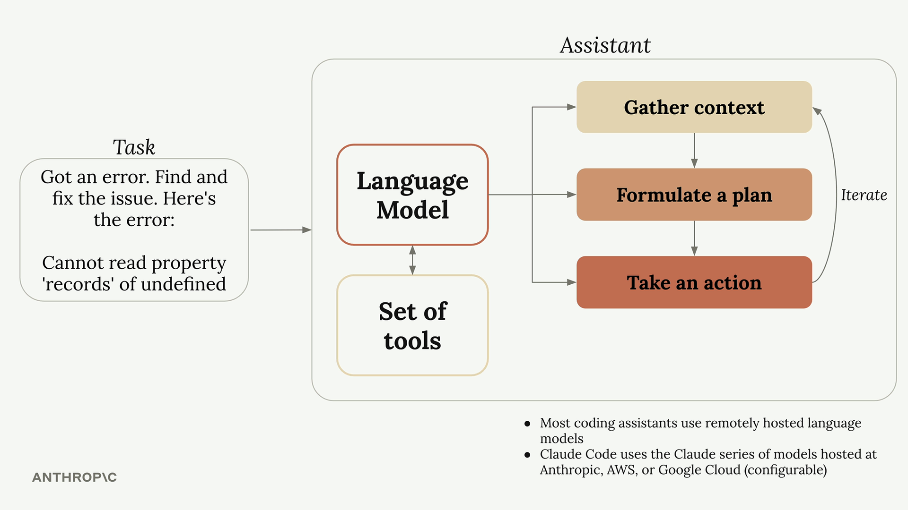
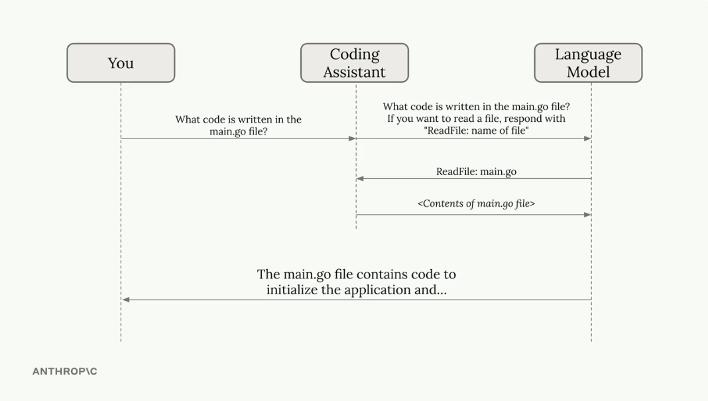

# What is Claude Code?

These are my notes from the *Claude Code in Action* course.

## 1. What is a coding assistant?

A coding assistant (CA) is a system that taps into the power of a language model to get programming tasks done.

## 2. How a coding assistant works

When we hand a CA a task, it usually works through it in three stages:

- **Gather context** — understand what's going on around the request.
- **Make a plan** — decide how to tackle the problem.
- **Act** — carry out the plan step by step.

## 3. What are Tools, and how do they work?

- A language model, on its own, only deals with language — it can't read files or run commands.
- A CA makes up for that by giving the model a set of **Tools**.
- When we send a request to the CA, it quietly adds instructions to that request so the model knows how to use the Tools.

- The CA is the one that actually runs the commands. The language model is there to think.
- What makes Claude's CA strong is that it understands what Tools can do and uses them effectively.
